# Innergy Room Detection AI - System Architecture

## Architecture Overview

This document describes the system architecture for Innergy Room Detection AI, a blueprint room boundary detection system using computer vision. The architecture follows a serverless pattern with AWS Lambda orchestration, SageMaker ML inference, and S3 storage for scalability and cost optimization.

---

## Architecture Diagram

```mermaid
graph TB
    subgraph "Client Browser"
        subgraph "React Application"
            UI[UI Components]
            
            subgraph "Components Layer"
                Upload[Upload Components<br/>DropZone/FilePreview/UploadProgress<br/>Max 10MB, PNG/JPG/PDF]
                Visualization[Visualization Components<br/>BlueprintCanvas/RoomOverlay/ZoomControls<br/>Konva.js rendering]
                Results[Results Components<br/>DetectionList/ConfidenceSlider/ExportButtons]
                Layout[Layout Components<br/>Header/Sidebar/StatusBar]
            end
            
            subgraph "State Management"
                UploadCtx[Upload Context<br/>File state, progress, metadata]
                DetectionCtx[Detection Context<br/>Bounding boxes, confidence scores]
            end
            
            subgraph "Custom Hooks"
                useUpload[useUpload<br/>Upload to S3, track progress]
                useDetection[useDetection<br/>Trigger inference, poll status]
                useVisualization[useVisualization<br/>Canvas rendering, zoom/pan]
                useExport[useExport<br/>Download JSON, copy to clipboard]
            end
            
            subgraph "Services Layer"
                APIClient[API Client<br/>Axios HTTP client for Lambda]
                S3Service[S3 Service<br/>Presigned URL uploads + downloads]
                SessionManager[Session Manager<br/>sessionStorage management]
                CanvasRenderer[Canvas Renderer<br/>Blueprint + overlay rendering]
            end
            
            subgraph "Rendering Engine"
                Konva[Konva.js<br/>HTML5 Canvas<br/>60 FPS target]
            end
            
            subgraph "Utilities"
                Helpers[Helper Functions<br/>generateId, formatBytes, validateFile]
                Constants[Constants<br/>MAX_FILE_SIZE, CONFIDENCE_THRESHOLD]
            end
        end
    end
    
    subgraph "AWS Cloud Infrastructure"
        subgraph "API Gateway"
            APIGW[REST API Gateway<br/>CORS enabled<br/>Rate limiting: 10k req/s]
        end
        
        subgraph "Lambda Functions (Python 3.9)"
            UploadLambda[Upload Handler<br/>POST /upload<br/>Validate file, store in S3<br/>Return presigned URL]
            DetectLambda[Inference Trigger<br/>POST /detect<br/>Call SageMaker endpoint<br/>Store results in S3]
            ResultsLambda[Results Retriever<br/>GET /results/:id<br/>Fetch from S3<br/>Format JSON response]
        end
        
        subgraph "SageMaker ML Service"
            SageMakerEndpoint[YOLOv5 Endpoint<br/>ml.m5.large instance<br/>Auto-scaling: 1-3 instances<br/>Inference latency: <30s]
        end
        
        subgraph "S3 Storage"
            S3Bucket[(S3 Bucket<br/>innergy-blueprints-dev<br/>Lifecycle: 7 days<br/>Versioning disabled)]
        end
        
        subgraph "CloudFront CDN"
            CloudFront[Static Website Hosting<br/>React build files<br/>HTTPS + caching]
        end
    end
    
    subgraph "Development Tools"
        LocalDev[Local YOLOv5<br/>PyTorch model<br/>For training/testing]
        VSCode[VS Code + GitHub<br/>Version control<br/>Collaboration]
    end
    
    %% Component to Context connections
    Upload --> UploadCtx
    Visualization --> DetectionCtx
    Results --> DetectionCtx
    
    %% Context to Hooks connections
    UploadCtx --> useUpload
    DetectionCtx --> useDetection
    DetectionCtx --> useVisualization
    DetectionCtx --> useExport
    
    %% Hooks to Services connections
    useUpload --> APIClient
    useUpload --> S3Service
    useDetection --> APIClient
    useVisualization --> CanvasRenderer
    useExport --> SessionManager
    
    %% API Client to Lambda
    APIClient --> APIGW
    
    %% API Gateway routing
    APIGW -->|POST /upload| UploadLambda
    APIGW -->|POST /detect| DetectLambda
    APIGW -->|GET /results/:id| ResultsLambda
    
    %% Lambda to S3 interactions
    UploadLambda -->|Store blueprint<br/>original.png + metadata.json| S3Bucket
    S3Bucket -->|Presigned URL| UploadLambda
    
    DetectLambda -->|Read blueprint from S3| S3Bucket
    DetectLambda -->|Invoke inference| SageMakerEndpoint
    SageMakerEndpoint -->|Return bounding boxes<br/>JSON array| DetectLambda
    DetectLambda -->|Store results.json| S3Bucket
    
    ResultsLambda -->|Fetch results.json| S3Bucket
    ResultsLambda -->|Return formatted JSON| APIGW
    
    %% S3 Service for presigned URLs
    S3Service -->|Upload via presigned URL| S3Bucket
    S3Service -->|Download results| S3Bucket
    
    %% Rendering
    Visualization --> Konva
    CanvasRenderer --> Konva
    
    %% Utilities
    Helpers -.-> Upload
    Helpers -.-> Results
    Constants -.-> Upload
    Constants -.-> Results
    
    %% Session storage
    SessionManager -.->|Persist session data| Browser[(Browser Storage<br/>sessionStorage)]
    
    %% Deployment
    UI -.->|Build & Deploy<br/>npm run build| CloudFront
    CloudFront -->|Serve React app| UI
    
    %% Development workflow
    LocalDev -.->|Train model locally| SageMakerEndpoint
    VSCode -.->|Deploy Lambda functions| UploadLambda
    
    %% User interactions
    User([Users<br/>Architects/Engineers]) -->|Upload blueprints| UI
    User -->|Access deployed app| CloudFront
    
    %% Styling
    classDef client fill:#e3f2fd,stroke:#1976d2,stroke-width:2px
    classDef aws fill:#fff3e0,stroke:#f57c00,stroke-width:2px
    classDef ml fill:#e8f5e9,stroke:#388e3c,stroke-width:2px
    classDef storage fill:#f3e5f5,stroke:#7b1fa2,stroke-width:2px
    classDef dev fill:#fce4ec,stroke:#c2185b,stroke-width:2px
    classDef user fill:#ffebee,stroke:#d32f2f,stroke-width:3px
    
    class Upload,Visualization,Results,Layout,UploadCtx,DetectionCtx,useUpload,useDetection,useVisualization,useExport,APIClient,S3Service,SessionManager,CanvasRenderer,Helpers,Constants client
    class APIGW,UploadLambda,DetectLambda,ResultsLambda,CloudFront aws
    class SageMakerEndpoint,LocalDev ml
    class S3Bucket,Browser storage
    class VSCode dev
    class User user
    class Konva rendering
```



---

## System Components

### Frontend Architecture

#### 1. Components Layer

**Upload Components**
- **Purpose**: Handle blueprint file uploads with validation and progress tracking
- **Key Components**:
  - `DropZone.jsx`: Drag-and-drop file upload area with visual feedback
  - `FilePreview.jsx`: Display uploaded blueprint thumbnail and metadata
  - `UploadProgress.jsx`: Show upload progress bar (0-100%)
- **Specifications**: Max 10MB file size, PNG/JPG/PDF formats only, client-side validation

**Visualization Components**
- **Purpose**: Display blueprint with detected room boundary overlays
- **Key Components**:
  - `BlueprintCanvas.jsx`: Konva.js Stage and Layer for blueprint rendering
  - `RoomOverlay.jsx`: Render bounding boxes with confidence scores
  - `ZoomControls.jsx`: Zoom (25%-400%) and pan controls
- **Specifications**: 60 FPS rendering target, smooth zoom/pan, hover tooltips

**Results Components**
- **Purpose**: Display detection results and export options
- **Key Components**:
  - `DetectionList.jsx`: List all detected rooms with confidence scores
  - `ConfidenceSlider.jsx`: Filter detections by confidence threshold (0.3-0.9)
  - `ExportButtons.jsx`: Download JSON, copy to clipboard, download annotated image

**Layout Components**
- **Purpose**: Application shell and navigation
- **Key Components**:
  - `Header.jsx`: App title, session ID, upload button
  - `Sidebar.jsx`: Detection list, confidence slider, export options
  - `StatusBar.jsx`: Processing status, error messages, progress indicator

#### 2. State Management

**Upload Context**
- **State**: `uploadedFile`, `uploadProgress`, `blueprintId`, `sessionId`, `uploadStatus`
- **Methods**: `uploadBlueprint()`, `resetUpload()`, `setProgress()`
- **Purpose**: Manage blueprint upload lifecycle from selection to completion

**Detection Context**
- **State**: `detections`, `confidenceThreshold`, `processingStatus`, `blueprintMetadata`
- **Methods**: `triggerDetection()`, `updateThreshold()`, `filterDetections()`
- **Purpose**: Manage AI detection results and user interaction with results

#### 3. Custom Hooks

**useUpload**
- **Purpose**: Handle file upload to S3 via presigned URLs
- **Returns**: `uploadBlueprint()`, `uploadProgress`, `error`, `isUploading`
- **Operations**: Validate file, get presigned URL from Lambda, upload to S3, track progress

**useDetection**
- **Purpose**: Trigger SageMaker inference and poll for results
- **Returns**: `triggerDetection()`, `detections`, `isProcessing`, `processingStatus`
- **Operations**: POST to /detect endpoint, poll GET /results/:id every 2 seconds

**useVisualization**
- **Purpose**: Manage canvas rendering and user interactions
- **Returns**: `zoomLevel`, `panOffset`, `handleZoom()`, `handlePan()`
- **Operations**: Calculate zoom/pan transforms, update canvas on interaction

**useExport**
- **Purpose**: Export detection results in various formats
- **Returns**: `downloadJSON()`, `downloadAnnotatedImage()`, `copyToClipboard()`
- **Operations**: Format results, trigger browser download, copy to clipboard API

#### 4. Services Layer

**API Client (Axios)**
- **Responsibilities**:
  - HTTP requests to API Gateway endpoints
  - Request/response interceptors for error handling
  - Automatic retry logic for failed requests
- **Key Functions**:
  - `uploadBlueprint(file)`: POST /upload with multipart form data
  - `triggerDetection(blueprintId)`: POST /detect with blueprint ID
  - `getResults(blueprintId)`: GET /results/:blueprintId

**S3 Service**
- **Responsibilities**:
  - Upload files to S3 using presigned URLs
  - Download results from S3
  - Track upload progress via Axios progress events
- **Key Functions**:
  - `uploadToS3(presignedUrl, file, onProgress)`: PUT request with progress tracking
  - `downloadFromS3(url)`: Fetch file from S3 presigned URL

**Session Manager**
- **Responsibilities**:
  - Persist session data across page refreshes
  - Generate unique session IDs
  - Clear session data on logout or timeout
- **Key Functions**:
  - `getSessionId()`: Retrieve or generate session ID
  - `saveSession(data)`: Store data in sessionStorage
  - `clearSession()`: Remove all session data

**Canvas Renderer**
- **Responsibilities**:
  - Render blueprint image on Konva Stage
  - Draw room boundary overlays with colors and labels
  - Handle zoom/pan transformations
- **Key Functions**:
  - `renderBlueprint(imageUrl, stageRef)`: Load and display blueprint
  - `renderOverlays(detections, stageRef)`: Draw bounding boxes
  - `applyTransform(zoom, pan, stageRef)`: Update canvas transform

#### 5. Rendering Engine

**Konva.js**
- **Purpose**: High-performance HTML5 Canvas rendering for blueprints
- **Performance Target**: 60 FPS during zoom/pan operations
- **Key Features**:
  - Hardware-accelerated rendering
  - Event handling for canvas interactions (click, drag, hover)
  - Layer-based rendering (blueprint layer, overlay layer)

#### 6. Utilities

**Helper Functions**
- `generateId()`: Generate UUID v4 for session/blueprint IDs
- `formatBytes(bytes)`: Convert bytes to human-readable size (KB, MB)
- `validateFile(file)`: Check file type, size, and format
- `calculateBoundingBox(detection)`: Convert model output to canvas coordinates

**Constants**
- `MAX_FILE_SIZE`: 10 * 1024 * 1024 (10MB)
- `ALLOWED_FORMATS`: ['image/png', 'image/jpeg', 'application/pdf']
- `DEFAULT_CONFIDENCE_THRESHOLD`: 0.5
- `ZOOM_MIN`: 0.25, `ZOOM_MAX`: 4.0
- `POLLING_INTERVAL`: 2000 (2 seconds)

---

### Backend Architecture

#### 1. API Gateway

**Provider**: AWS API Gateway (REST API)  
**Purpose**: Expose Lambda functions as RESTful endpoints with CORS support

**Endpoints**:
- `POST /upload` - Upload blueprint and get presigned S3 URL
- `POST /detect` - Trigger SageMaker inference for blueprint
- `GET /results/:blueprintId` - Retrieve detection results

**Configuration**:
- CORS enabled for frontend domain
- Rate limiting: 10,000 requests/second
- Request validation for query parameters
- API key authentication (optional for MVP)

#### 2. Lambda Functions (Python 3.9)

**Upload Handler Lambda**
- **Function Name**: `innergy-upload-handler`
- **Trigger**: POST /upload via API Gateway
- **Responsibilities**:
  - Validate uploaded file metadata (size, type)
  - Generate unique blueprintId (UUID v4)
  - Create S3 presigned URL for PUT operation
  - Store metadata.json in S3
- **Environment Variables**:
  - `S3_BUCKET_NAME`: innergy-blueprints-dev
  - `PRESIGNED_URL_EXPIRY`: 300 (5 minutes)
- **Response**:
```json
{
  "blueprintId": "uuid-v4",
  "presignedUrl": "https://s3.amazonaws.com/...",
  "expiresIn": 300
}
```

**Inference Trigger Lambda**
- **Function Name**: `innergy-detection-trigger`
- **Trigger**: POST /detect via API Gateway
- **Responsibilities**:
  - Read blueprint from S3 (original.png)
  - Invoke SageMaker endpoint with image data
  - Parse model output (bounding boxes)
  - Store results.json in S3
- **Environment Variables**:
  - `S3_BUCKET_NAME`: innergy-blueprints-dev
  - `SAGEMAKER_ENDPOINT`: yolov5-blueprint-detector
- **Response**:
```json
{
  "blueprintId": "uuid-v4",
  "status": "processing",
  "estimatedTime": 25
}
```

**Results Retriever Lambda**
- **Function Name**: `innergy-results-fetcher`
- **Trigger**: GET /results/:blueprintId via API Gateway
- **Responsibilities**:
  - Fetch results.json from S3
  - Format response with metadata
  - Return detection results
- **Environment Variables**:
  - `S3_BUCKET_NAME`: innergy-blueprints-dev
- **Response**:
```json
{
  "blueprintId": "uuid-v4",
  "detections": [...],
  "metadata": {...},
  "processingTime": 12.5
}
```

#### 3. SageMaker ML Service

**Endpoint Name**: `yolov5-blueprint-detector`  
**Purpose**: Host YOLOv5 model for room boundary detection

**Configuration**:
- Instance type: ml.m5.large (2 vCPU, 8GB RAM)
- Auto-scaling: 1-3 instances based on request volume
- Model framework: PyTorch 1.10 (YOLOv5)
- Input: Image file from S3 (PNG/JPG, max 10MB)
- Output: JSON array of bounding boxes

**Input Format**:
```json
{
  "image_s3_path": "s3://innergy-blueprints-dev/uploads/session-abc/blueprint-001/original.png"
}
```

**Output Format (COCO-style)**:
```json
{
  "detections": [
    {
      "bbox": [100, 200, 300, 250],
      "confidence": 0.89,
      "class": "room"
    }
  ],
  "inference_time": 11.2
}
```

**Performance Metrics**:
- Inference latency: <30 seconds per blueprint
- Cold start time: 15-20 seconds (first request after idle)
- Throughput: 2-3 requests/minute per instance
- Model size: 50MB (YOLOv5s variant)

#### 4. S3 Storage

**Bucket Name**: `innergy-blueprints-dev`  
**Purpose**: Store uploaded blueprints, metadata, and detection results

**Bucket Structure**:
```
innergy-blueprints-dev/
  uploads/
    {sessionId}/
      {blueprintId}/
        original.png          # Uploaded blueprint
        metadata.json         # Upload metadata
        results.json          # Detection results
        annotated.png         # Blueprint with overlays (optional)
```

**Lifecycle Policy**:
- Auto-delete objects after 7 days
- Transition to Glacier after 3 days (optional cost optimization)

**Access Control**:
- Private bucket (no public access)
- Lambda functions have IAM role with S3 read/write permissions
- Presigned URLs for temporary client access

#### 5. CloudFront CDN

**Distribution Name**: `innergy-frontend`  
**Purpose**: Serve React application with global CDN for low latency

**Configuration**:
- Origin: S3 bucket (React build files)
- Caching: 24 hours for static assets (JS/CSS/images)
- HTTPS: Required (SSL certificate via ACM)
- Compression: Gzip enabled
- Error pages: Custom 404 routing to index.html (SPA support)

---

## Data Flow Patterns

### 1. Blueprint Upload Flow

```
User Selects File (UI)
    ↓
Upload Component (validate file)
    ↓
Upload Context (setUploadedFile)
    ↓
useUpload Hook (uploadBlueprint)
    ↓
API Client (POST /upload)
    ↓
API Gateway → Upload Lambda
    ↓
Lambda: Generate blueprintId, create S3 presigned URL
    ↓
Lambda → Return presignedUrl to client
    ↓
S3 Service (PUT to presigned URL with progress tracking)
    ↓
S3 Bucket (store original.png + metadata.json)
    ↓
Upload Context (set blueprintId, uploadProgress = 100%)
    ↓
UI: Show "Upload Complete" + enable "Detect" button
```

**Latency Target**: <5 seconds for 5MB blueprint upload

### 2. AI Detection Flow

```
User Clicks "Detect Rooms" Button
    ↓
Detection Context (triggerDetection)
    ↓
useDetection Hook (POST /detect)
    ↓
API Gateway → Detect Lambda
    ↓
Lambda: Read blueprint from S3
    ↓
Lambda: Invoke SageMaker endpoint (async)
    ↓
SageMaker: Load YOLOv5 model (if cold start)
    ↓
SageMaker: Run inference on blueprint
    ↓
SageMaker → Return bounding boxes to Lambda
    ↓
Lambda: Format results, store results.json in S3
    ↓
Lambda → Return {status: "complete", blueprintId}
    ↓
useDetection Hook: Poll GET /results/:blueprintId every 2s
    ↓
Results Lambda: Fetch results.json from S3
    ↓
Results Lambda → Return detections to client
    ↓
Detection Context (setDetections)
    ↓
UI: Render room overlays on canvas
```

**Processing Time**: 25-45 seconds (15-20s SageMaker cold start + 10-25s inference)

### 3. Visualization Rendering Flow

```
Detection Results Loaded
    ↓
Detection Context (detections array)
    ↓
Visualization Component (receive detections as props)
    ↓
useVisualization Hook (prepare canvas rendering)
    ↓
Canvas Renderer (renderBlueprint + renderOverlays)
    ↓
Konva Stage: Draw blueprint image
    ↓
Konva Layer: Draw bounding boxes with colors
    ↓
For each detection:
  - Draw Rectangle (x, y, width, height)
  - Apply color from palette
  - Add confidence badge
  - Attach hover tooltip
    ↓
User Interaction (hover/zoom/pan):
  - Event handlers update Konva transform
  - Re-render affected layers only (performance optimization)
```

**Rendering Performance**: 60 FPS during interactions

### 4. Export Flow

```
User Clicks "Download JSON"
    ↓
useExport Hook (downloadJSON)
    ↓
Format detections as JSON:
  {
    blueprintId,
    detections: [...],
    metadata: {...}
  }
    ↓
Create Blob from JSON string
    ↓
Trigger browser download:
  - Create temporary <a> element
  - Set href to Blob URL
  - Set download attribute to filename
  - Click programmatically
    ↓
Browser: Save file to Downloads folder
```

**Alternative: Copy to Clipboard**
```
User Clicks "Copy to Clipboard"
    ↓
useExport Hook (copyToClipboard)
    ↓
JSON.stringify(detections)
    ↓
navigator.clipboard.writeText(json)
    ↓
Show "Copied!" toast notification
```

---

## Performance Characteristics

### Target Metrics

| Metric | Target | Measurement |
|--------|--------|-------------|
| UI Frame Rate | 60 FPS | During zoom/pan interactions |
| Upload Time | <5s | For 5MB blueprint |
| SageMaker Inference | <30s | Per blueprint (warm start) |
| Cold Start Delay | <20s | First request after idle |
| API Response Time | <3s | Lambda execution (excluding ML) |
| Results Polling | 2s interval | Status check frequency |
| Total Processing Time | <45s | Upload → Detection → Results |

### Optimization Strategies

**1. Lazy Loading**
- Load blueprint image only when needed
- Defer rendering overlays until detections arrive
- Use React.lazy() for code splitting

**2. Canvas Rendering Optimization**
- Use Konva layers for blueprint vs. overlays
- Redraw only changed layers during interactions
- Cache blueprint image to avoid reloading

**3. S3 Optimization**
- Use presigned URLs to avoid proxying through Lambda
- Enable S3 Transfer Acceleration for faster uploads (optional)
- Compress images before upload (optional)

**4. SageMaker Cost Optimization**
- Use on-demand endpoints (no hourly charges when idle)
- Scale down to 0 instances after 15 minutes of inactivity
- Consider Lambda-based inference for small models (future)

**5. API Gateway Caching**
- Cache GET /results/:blueprintId responses for 5 minutes
- Reduces S3 read operations and Lambda invocations

---

## Security Architecture

### API Security

- **CORS**: Enabled for frontend domain only
- **Rate Limiting**: 10,000 requests/second per API key
- **Request Validation**: Schema validation for POST bodies
- **API Keys**: Optional for MVP (can add later)

### Lambda Security

**IAM Roles**:
```json
{
  "Version": "2012-10-17",
  "Statement": [
    {
      "Effect": "Allow",
      "Action": [
        "s3:PutObject",
        "s3:GetObject",
        "s3:DeleteObject"
      ],
      "Resource": "arn:aws:s3:::innergy-blueprints-dev/*"
    },
    {
      "Effect": "Allow",
      "Action": [
        "sagemaker:InvokeEndpoint"
      ],
      "Resource": "arn:aws:sagemaker:*:*:endpoint/yolov5-blueprint-detector"
    }
  ]
}
```

### S3 Security

**Bucket Policy**:
- Block all public access
- Allow access only from Lambda execution roles
- Presigned URLs expire after 5 minutes

**Encryption**:
- Server-side encryption (SSE-S3) enabled
- HTTPS required for all requests

### Data Validation

- **File Upload**: Validate MIME type, file size, extension
- **Blueprint ID**: UUID v4 format validation
- **Bounding Boxes**: Validate coordinates within blueprint dimensions
- **Confidence Scores**: Validate range (0.0 to 1.0)

---

## Testing Strategy

### Unit Tests

**Framework**: pytest (Python), Vitest (JavaScript)

**Coverage Areas**:
- Helper functions (validateFile, formatBytes, generateId)
- Lambda function logic (mocked S3/SageMaker calls)
- Canvas rendering calculations
- Export/download utilities

**Example Test Cases**:
```python
# Lambda Upload Handler
def test_upload_handler_invalid_file_type():
    event = {"body": json.dumps({"fileName": "test.exe"})}
    response = upload_handler(event, None)
    assert response["statusCode"] == 400
    assert "Invalid file type" in response["body"]
```

### Integration Tests

**Framework**: pytest + boto3 mocking (moto library)

**Test Scenarios**:
1. Upload → Detect → Results (full E2E flow)
2. Upload with oversized file (should fail with 413)
3. Detect with non-existent blueprintId (should fail with 404)
4. SageMaker timeout handling (mock slow inference)
5. S3 presigned URL expiration (should regenerate)

### Load Testing

**Tool**: Apache JMeter or Locust

**Scenarios**:
- 10 concurrent users uploading blueprints
- 50 requests/second to GET /results endpoint
- SageMaker auto-scaling under load (1 → 3 instances)

---

## Deployment Architecture

### Build Process

**Frontend (React)**:
```bash
# Install dependencies
npm install

# Run linting
npm run lint

# Run unit tests
npm run test

# Build production bundle
npm run build
# Output: dist/ directory (gzipped: ~200KB)
```

**Backend (Lambda)**:
```bash
# Install Python dependencies
pip install -r requirements.txt -t ./package

# Package Lambda deployment zip
cd package && zip -r ../lambda-upload.zip .
cd .. && zip -g lambda-upload.zip upload_handler.py

# Deploy via AWS SAM
sam build
sam deploy --guided
```

### Deployment Pipeline

```
Local Development
    ↓
Git Push to GitHub (main branch)
    ↓
(Optional) GitHub Actions CI/CD
    ↓
Run Tests (pytest + vitest)
    ↓
Build React App (npm run build)
    ↓
Build Lambda Packages (SAM build)
    ↓
Deploy Frontend to S3 + CloudFront (aws s3 sync)
    ↓
Deploy Lambda Functions (sam deploy)
    ↓
Deploy SageMaker Model (boto3 script)
    ↓
Production URL: https://innergy-ai.cloudfront.net
```

### Environment Configuration

**Development (.env.development)**:
```env
VITE_API_GATEWAY_URL=https://dev-api.execute-api.us-east-1.amazonaws.com/v1
VITE_S3_BUCKET=innergy-blueprints-dev
VITE_SESSION_TIMEOUT=3600000
```

**Production (.env.production)**:
```env
VITE_API_GATEWAY_URL=https://api.innergy-ai.com/v1
VITE_S3_BUCKET=innergy-blueprints-prod
VITE_SESSION_TIMEOUT=7200000
```

---

## Scalability Considerations

### Current Limitations (MVP)

1. **Single User Sessions**: No multi-user collaboration
2. **SageMaker Capacity**: Max 3 instances (6-9 concurrent requests)
3. **S3 Storage**: 7-day retention (lifecycle policy)
4. **No Caching**: Results fetched from S3 every time

### Future Scalability Plans

**Phase 2**:
- Add DynamoDB for metadata storage (fast queries)
- Implement user authentication (AWS Cognito)
- Enable blueprint library (save/retrieve past uploads)
- Add Redis cache for frequently accessed results

**Phase 3**:
- Multi-region SageMaker endpoints (lower latency)
- S3 cross-region replication for global users
- CloudFront edge caching for API responses
- Batch processing API for multiple blueprints

**Phase 4**:
- Real-time WebSocket updates (replace polling)
- Serverless Aurora for relational queries
- Step Functions for complex ML pipelines
- SageMaker Batch Transform for cost optimization

---

## Monitoring & Observability

### Key Metrics to Monitor

**Application Metrics**:
- Upload success rate (target: >98%)
- Detection accuracy (target: >75%)
- Average processing time (target: <45s)
- API error rate (target: <2%)

**AWS Metrics**:
- Lambda invocation count, duration, errors
- SageMaker endpoint latency, invocations, model loading time
- S3 request rate, storage usage, lifecycle transitions
- CloudFront cache hit ratio, data transfer

**User Experience Metrics**:
- Time to first detection result
- Confidence threshold adjustment frequency
- Export/download success rate

### Recommended Tools

**AWS Native**:
- CloudWatch Logs: Lambda function logs, API Gateway logs
- CloudWatch Metrics: Custom metrics for detection accuracy
- X-Ray: Distributed tracing for Lambda → SageMaker → S3

**Third-Party (Optional)**:
- Sentry: Frontend error tracking
- Datadog: Unified monitoring across AWS services
- LogRocket: Session replay for debugging user issues

---

## Technology Choices Rationale

### Why React + Vite?

- Fast development experience (HMR, ES modules)
- Smaller bundle size vs. Create React App
- Modern tooling with minimal configuration
- Large ecosystem for UI libraries (Tailwind, Konva)

### Why AWS Lambda?

- No server management (fully serverless)
- Pay-per-request pricing (low cost for MVP)
- Auto-scaling built-in (handles traffic spikes)
- Fast iteration (deploy functions independently)

### Why SageMaker?

- Production-ready ML model hosting
- Auto-scaling and load balancing
- Built-in monitoring and logging
- Easy model updates (blue/green deployments)
- Lower latency than Lambda-based inference

### Why Konva.js?

- High-performance HTML5 Canvas rendering
- Built-in event handling (click, drag, hover)
- Layer-based architecture (blueprint vs. overlays)
- Better than SVG for large/complex visualizations
- 60 FPS performance with hardware acceleration

### Why S3 (No Database)?

- Simple storage for MVP (no schema management)
- Lifecycle policies for automatic cleanup
- Presigned URLs for secure client-side uploads
- Lower cost than DynamoDB for infrequent access
- Can migrate to database in Phase 2 if needed

---

## Known Issues & Limitations

### MVP Limitations

1. **No Authentication**: Anyone can upload blueprints (no user accounts)
2. **No Blueprint History**: Cannot view past uploads (cleared after 7 days)
3. **Single Blueprint Processing**: Cannot upload multiple files at once
4. **Limited Formats**: Only PNG/JPG/PDF (no DWG/DXF CAD files)
5. **Fixed Model**: Cannot retrain or fine-tune without redeploying
6. **Polling-Based Status**: 2-second delay for status updates (no WebSockets)
7. **No Room Labeling**: Model detects boundaries only (not room types)
8. **Cold Start Delays**: 15-20 second wait on first request after idle

### Technical Debt

1. **Manual SageMaker Deployment**: Need automated model deployment pipeline (MLOps)
2. **No Automated Tests**: Add pytest/vitest CI/CD integration
3. **Hardcoded Thresholds**: Move configuration to environment variables
4. **No Error Analytics**: Add Sentry or CloudWatch Insights for error tracking

---

## References

- AWS Lambda Documentation: https://docs.aws.amazon.com/lambda/
- SageMaker Endpoints: https://docs.aws.amazon.com/sagemaker/latest/dg/deploy-model.html
- YOLOv5 Documentation: https://github.com/ultralytics/yolov5
- Konva.js Documentation: https://konvajs.org/docs/
- React + Vite: https://vitejs.dev/guide/
- Project PRD: `PRD.md`
- Task List: `tasks.md`

---

## Appendix: Data Schema Details

### S3 Metadata Schema

**metadata.json**:
```typescript
interface BlueprintMetadata {
  blueprintId: string; // UUID v4
  sessionId: string;
  fileName: string;
  uploadedAt: string; // ISO 8601
  dimensions: {
    width: number;
    height: number;
  };
  fileSize: number; // bytes
  format: 'png' | 'jpg' | 'jpeg' | 'pdf';
}
```

### Detection Results Schema

**results.json**:
```typescript
interface DetectionResults {
  blueprintId: string;
  modelVersion: string; // e.g., "yolov5s-v1.0"
  processingTime: number; // seconds
  detectedAt: string; // ISO 8601
  detections: Detection[];
  statistics: {
    totalRooms: number;
    avgConfidence: number;
    processingSteps: string[];
  };
}

interface Detection {
  roomId: number;
  boundingBox: {
    x: number; // top-left x
    y: number; // top-left y
    width: number;
    height: number;
  };
  confidence: number; // 0.0 to 1.0
  class: 'room';
  area: number; // width * height
}
```

### SageMaker Input/Output

**Input to SageMaker Endpoint**:
```json
{
  "image_s3_path": "s3://innergy-blueprints-dev/uploads/session-abc/blueprint-001/original.png"
}
```

**Output from SageMaker Endpoint (COCO format)**:
```json
{
  "detections": [
    {
      "bbox": [100, 200, 300, 250],
      "confidence": 0.89,
      "class": "room"
    }
  ],
  "inference_time": 11.2,
  "model_version": "yolov5s-v1.0"
}
```